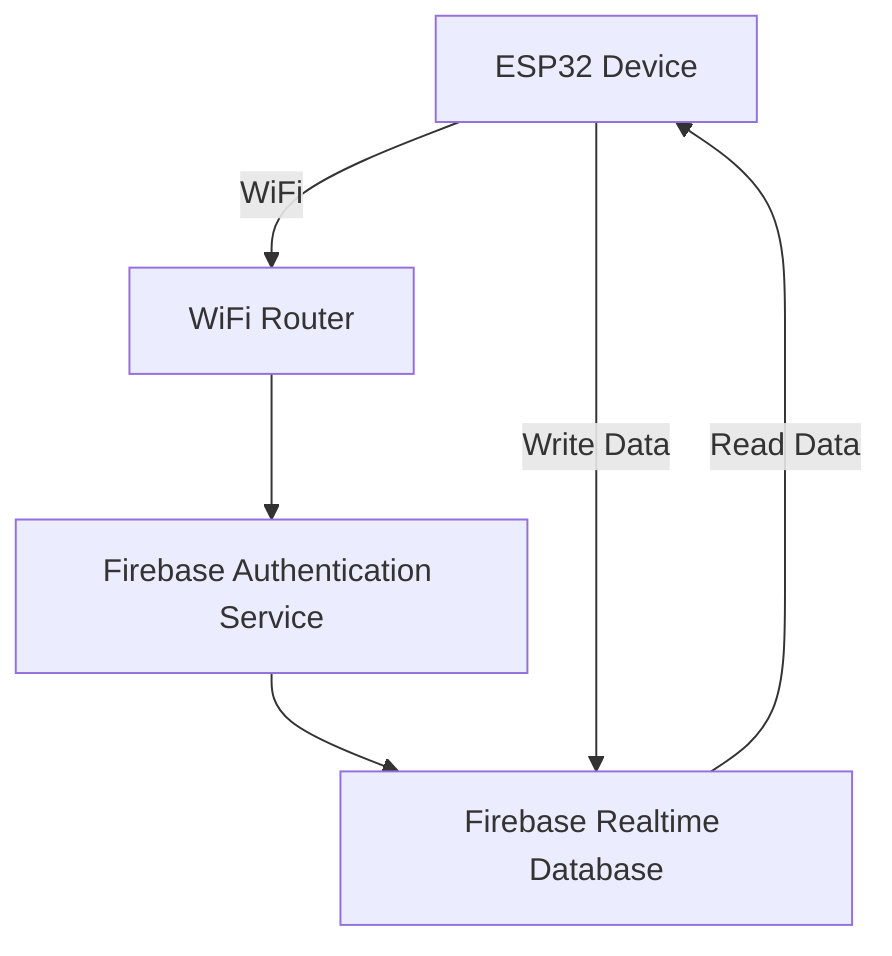
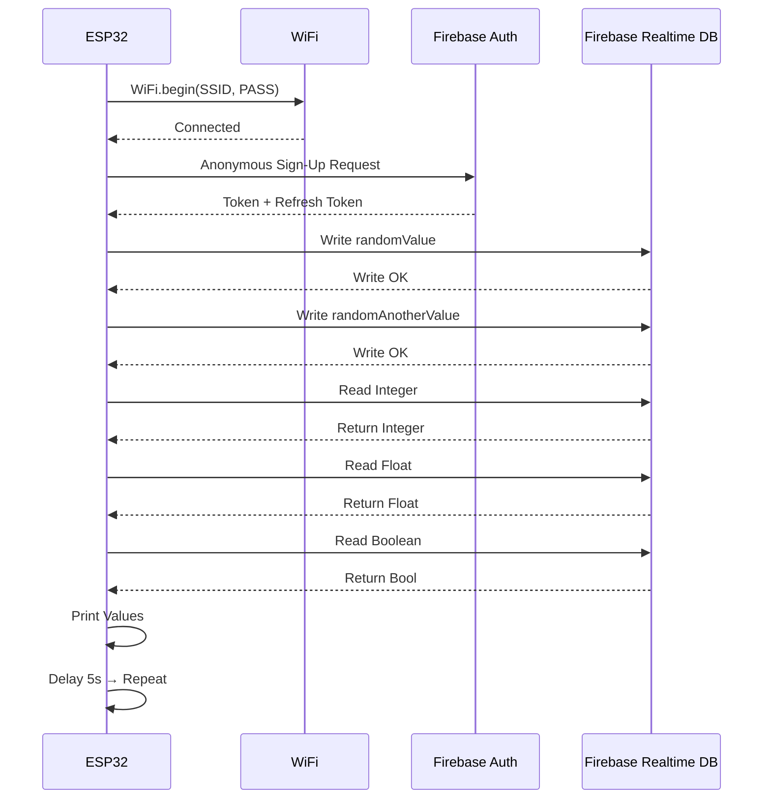
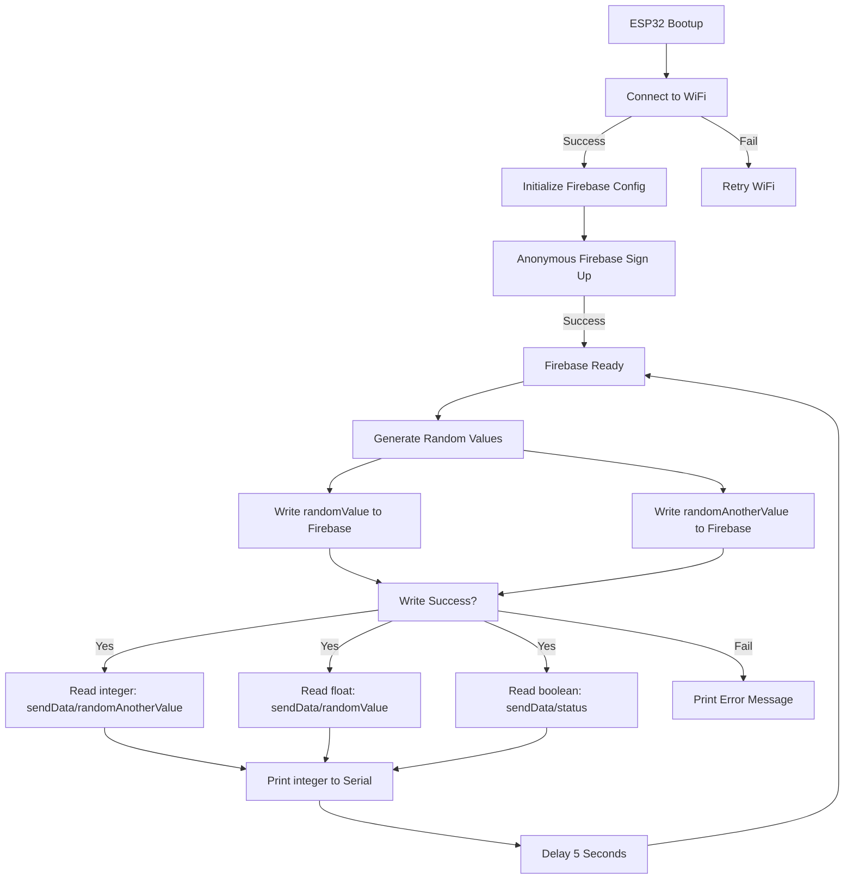

# ESP32 ↔ Firebase Realtime Database

### 🚀 Real-Time Data Sync using Firebase ESP Client
<p align="center">  &nbsp;&nbsp;&nbsp;  </p> <p align="center"> <b>An ESP32 project demonstrating real-time read/write operations with Firebase Realtime Database.</b> </p>

### Badges
<p align="left">     </p>

# Project Overview

This project demonstrates two-way communication between an ESP32 microcontroller and Firebase Realtime Database.
It covers:

- Connecting to WiFi
- Firebase authentication
- Sending random data to RTDB
- Reading integer, float & boolean values
- Real-time updates every 5 seconds

## Architecture Diagram

# Firebase Data Structure Preview
```bash
{
  "receiveData": {
    "randomValue": 35,
    "randomAnotherValue": 142
  },
  "sendData": {
    "randomValue": 77.5,
    "randomAnotherValue": 53,
    "status": true
  }
}
```
## Feature	Description
| Feature | Description |
|--------|-------------|
| 📡 WiFi Connectivity | Connect ESP32 to your router |
| 🔐 Firebase Auth | Automatic anonymous sign-in |
| 📝 Write Data | Upload integers to Firebase |
| 📥 Read Data | Receive integers, floats & boolean values |
| 🔄 Auto Loop | Refresh every 5 seconds |
| 🧪 Debugging | Serial monitor feedback |

## Hardware & Software Requirements
  ### Hardware
  - ESP32 Dev Board
  - USB Cable
  - WiFi Network
### Software
- Arduino IDE or PlatformIO
- Firebase ESP Client Library
- ESP32 Board Support 

## Getting Started
### 1. Install ESP32 in Arduino IDE
Tools → Board Manager → ESP32 by Espressif Systems
### 2. Install Required Libraries

```bash
Firebase ESP Client (Mobizt)
WiFi.h  (built-in)
```
### 3.Prepare Firebase
- Create Firebase Project
- Enable Realtime Database
- Enable Anonymous Authentication
- Copy your Web API Key
- Copy your RTDB URL

## Code Functionality Summary
### Sends data every 5 seconds
```bash
Firebase.RTDB.setInt(&fbdo, "receiveData/randomValue", receiveData);
```
### Reads values from Firebase
```
Firebase.RTDB.getInt(&fbdo, "sendData/randomAnotherValue");
Firebase.RTDB.getFloat(&fbdo, "sendData/randomValue");
Firebase.RTDB.getBool(&fbdo, "sendData/status");
```
### Serial Monitor Example
```
Sending Data: 42
Successfully sent to /receiveData/randomValue
Value received: 78.5
status = true
```
## Flow Diagram
# ESP32 ↔ Firebase Interactio


## ESP32 ↔ Firebase Realtime Database Flow Diagram



