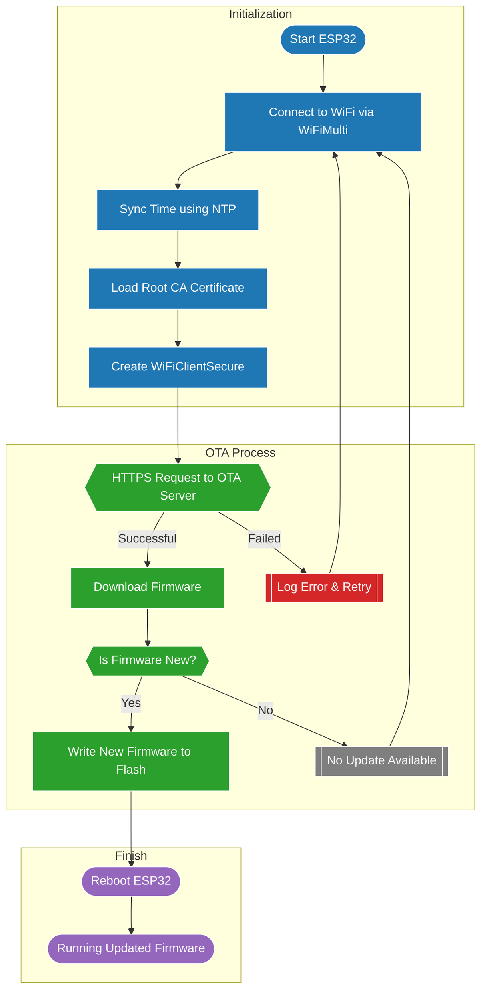

# Project Name 

ESP32 Secure OTA Update (HTTPS + Root CA Validation)

## Overview

This project demonstrates how to perform secure Over-The-Air (OTA) firmware updates on an ESP32 using:

- HTTPS with certificate validation (WiFiClientSecure)
- NTP time synchronization (required for TLS x.509 validation)
- ESP32 HTTPUpdate library
- A remote backend OTA server such as:https://backend.zeroozen.com/api/ota/download

The code automatically connects to WiFi, syncs time, validates server certificates, and attempts a secure OTA update.

## Features

- Secure HTTPS OTA updates
- Root CA certificate verification
- Automatic NTP clock sync
- Error handling & serial debug output
- Compatible with ESP32 boards using Arduino framework

## Requirements

Make sure you have installed:

Arduino IDE Libraries
- WiFi (included with ESP32 core)
- HTTPClient
- HTTPUpdate
- WiFiClientSecure

#  How It Works
  ### 1. Connect to WiFi
   Uses WiFiMulti to connect to one or more WiFi networks.

  ### 2. Sync Time via NTP
   TLS certificate validation requires correct UTC time:
 ```bash
git clone https://github.com/your/repo.git
```

  ### 3. Load Root CA Certificate
  The certificate is required for secure HTTPS validation.

  ### 4. Perform HTTPS OTA Update
   ```bash
  git clone httpUpdate.update(client, "https://backend.zeroozen.com/api/ota/download");
  ```
  ### 5.Reboot Automatically on Success
  The ESP32 reboots with the new firmware.

## Root CA Certificate
This project uses the Let's Encrypt X3 Cross-Signed Certificate.

## Usage

- Clone this repository.
- Open the .ino file in Arduino IDE.
- Update the following values:
   ```bash
  git clone WiFiMulti.addAP("YOUR_WIFI_SSID", "YOUR_WIFI_PASSWORD");
  ```
- (Optional) Replace the root CA certificate with your own.
- Upload to your ESP32.
- Open Serial Monitor at 115200 baud.
- The device will attempt to update from your remote OTA server.

## Serial Output Example

Example messages you may see:
```bash
[SETUP] WAIT 4...
Waiting for NTP time sync: ...
Current time: Tue Feb 11 12:34:56 2025

HTTP_UPDATE_OK
```
Or on failure:
```bash
HTTP_UPDATE_FAILED Error (-11): HTTPS error: certificate verification failed
```
## API Endpoint Requirements
 - Your OTA backend must:
 - Respond to GET /api/ota/download
 - Return raw firmware binary (.bin)
 - Use a valid HTTPS certificate
 - Support TLS 1.2+

## Important Notes
- NTP time sync must succeed for certificate validation.
- If your server uses a different CA, replace the certificate in the code.
- Timeout value is in seconds using client.setTimeout().

## Flowchart




