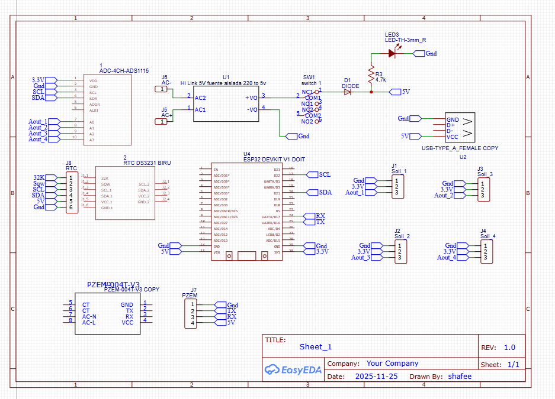
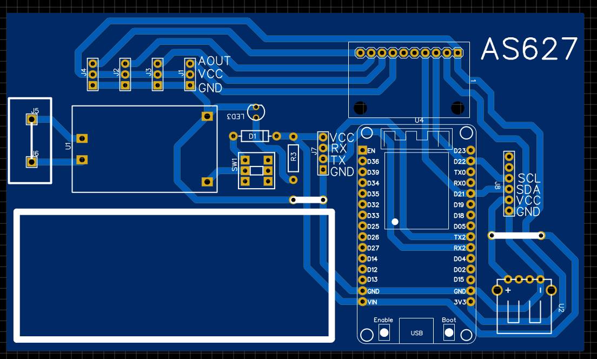
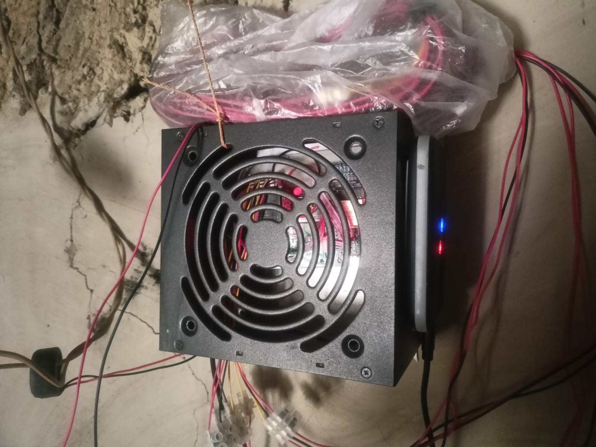
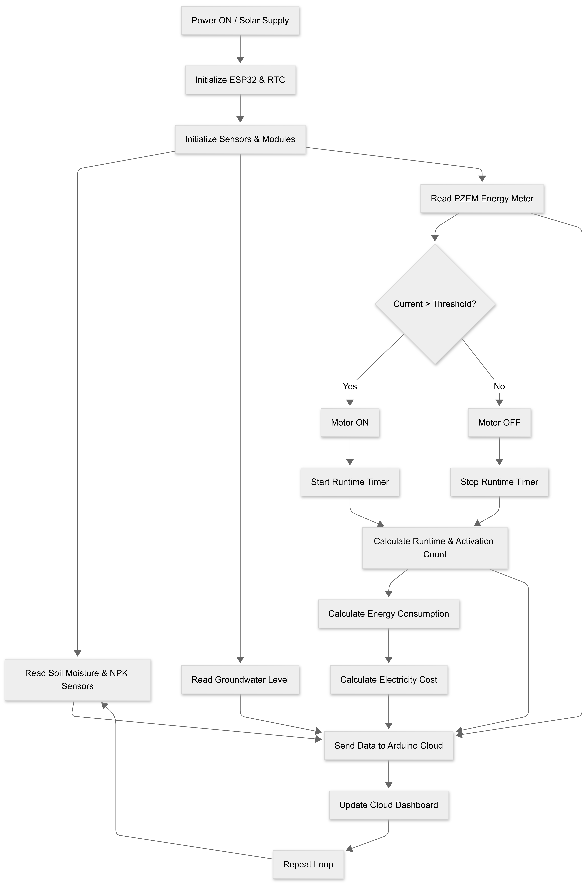

## IoT-Enabled Smart Solar Irrigation System

An IoT-based smart solar irrigation and groundwater monitoring system designed for agricultural applications.
The system monitors soil conditions, groundwater level, and 5HP motor electrical parameters, and visualizes real-time data using Arduino IoT Cloud Dashboard.

- Location: Gaibandha, Bangladesh
- Developed by: Shafee & Rupok

### Project Overview
This project combines solar irrigation, IoT monitoring, custom hardware, and cloud analytics to help farmers and researchers monitor water usage, energy consumption, and irrigation efficiency in real time.

## Hardware Implementation
The hardware implementation of the IoT-enabled smart solar irrigation system was designed to operate reliably in real agricultural field conditions. The system integrates sensing, power monitoring, data processing, and wireless communication into a compact and field-deployable unit.

## Hardware Components
- ESP32 DevKit V1
- ADS1015 ADC (Soil moisture & NPK sensing)
- DS3231 RTC (Real-time clock)
- PZEM-004T V3.0 (5HP motor energy monitoring)
- Soil Moisture Sensors (Multi-channel)
- Groundwater Level Sensor
- AC-DC Isolated Power Supply (220V → 5V)
- Custom PCB (EasyEDA)

## Custom PCB Implementation
A custom-designed PCB was developed using EasyEDA, integrating:
- ESP32 headers
- ADC inputs for soil sensors
- RTC interface
- PZEM communication pins
- Regulated power distribution
This PCB reduces wiring complexity, improves reliability, and makes the system suitable for long-term field deployment.
### Schametic Layout

### PCB Layout

## Control & Processing Unit
An ESP32 DevKit V1 is used as the main controller due to its built-in WiFi capability, high processing performance, and compatibility with Arduino IoT Cloud. It collects data from all sensors, processes measurements, and uploads real-time data to the cloud dashboard.

## Prototype

## Motor & Energy Monitoring Unit
To monitor the electrical performance of the 5HP irrigation motor, a PZEM-004T V3.0 energy meter is used. The system measures:
- Voltage (V)
- Current (A)
- Power (W)
- Energy (kWh)
- Frequency (Hz)
- Power Factor (PF)
The motor is monitored continuously, allowing detection of ON/OFF states, daily runtime, and total energy usage, which is critical for solar-powered irrigation systems.

## Field Installation

## Smart Calculations
- Total energy consumption
- Electricity cost (৳7.50 per unit)
- Motor ON/OFF detection
- Daily runtime tracking
- Daily activation count

## Soil & Groundwater Sensing
Multiple soil moisture sensors are installed in the field to monitor soil water content. Sensor signals are read using an ADS1015 ADC, enabling accurate multi-channel analog measurements.
A groundwater level sensor is also integrated to track underground water depth, supporting sustainable water usage decisions.

#Real-Time Clock (RTC)
A DS3231 RTC module is used to maintain accurate timekeeping. This allows:
- Timestamped data logging
- Daily runtime and activation count reset
- System recovery after power loss
RTC time is stored using ESP32 preferences to ensure persistence

## Arduino IoT Cloud Dashboard
The Arduino Cloud dashboard provides real-time visualization with both English and Bangla labels, making it farmer-friendly.

## Dashboard

## Dashboard Features
### Energy & Cost
- বিদ্যুৎ ব্যবহারের পরিমাণ (ইউনিট)
  → Total energy consumed (kWh)
- মোট বিদ্যুৎ খরচ (৭.৫০ টাকা/ইউনিট)
  → Automatic cost calculation in Bangladeshi Taka

### Motor Status
- Motor ON/OFF indicator
- Number of times motor turned ON
- Live motor status (Green = ON)
  
## Runtime Tracking
### Total motor running time
- Hour
- Minute
- Second
RTC-based accurate time display

### Groundwater Level
- বর্তমান ভূ-গর্ভস্থ পানির গভীরতা
- Gauge visualization (0–100%)

## Firmware Features
- ESP32 WiFi connectivity
- RTC time persistence using Preferences
- Motor ON/OFF detection via current threshold
- Daily runtime & activation reset
- Live cloud synchronization
- Serial debugging and manual RTC setup

## Field Deployment
- Tested in real agricultural field
- Solar-powered irrigation pump
- Weather-exposed environment
- Stable long-term operation

## Working Flow of the Project
When the system is powered ON using a solar or AC-DC supply, the ESP32 initializes and synchronizes the current date and time using the DS3231 real-time clock. All sensors and modules—including soil moisture and NPK sensors connected through the ADS1015 ADC, the groundwater level sensor, and the PZEM-004T energy meter—are then initialized. The ESP32 continuously acquires soil moisture, groundwater depth, and electrical parameters of the 5HP irrigation motor such as voltage, current, power, energy, frequency, and power factor. Based on the measured current, the system determines the motor ON/OFF state, tracks motor runtime, and counts daily activations. Using RTC data, daily runtime and counters are managed accurately, while total energy consumption and electricity cost are calculated. All processed data is sent in real time to the Arduino IoT Cloud, where it is visualized on the dashboard showing soil conditions, groundwater level, motor status, energy usage, cost, and runtime statistics, and this process runs continuously in a loop for real-time monitoring.

## Flowchart

